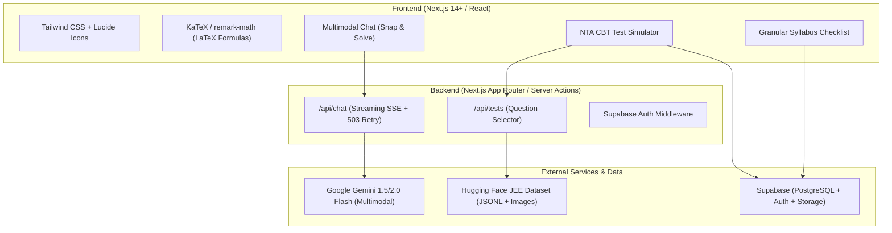

# Comprehensive Project Plan: JEE Mains & Advanced AI Learning Platform

---

## 1. Executive Summary & Vision

The goal is to build an intelligent, exam-grade web platform for IIT-JEE (Mains & Advanced) aspirants. The platform combines:
1. **Star Feature:** A 24/7 Multimodal AI Doubt Solving Tutor that understands complex math, circuit diagrams, and organic chemistry mechanisms, rendering responses with step-by-step LaTeX formatting.
2. **NTA-Standard CBT Mock Test Simulator:** A zero-API-cost exam engine powered by a local curated question bank with high-resolution visual diagrams and official marking schemes ($+4 / -1$).
3. **Granular Subtopic Syllabus Tracker:** A complete chapter & subtopic tracking checklist aligned with the official **JEE Syllabus & Exam Pattern**, calculating real-time exam readiness.
4. **Weakness Loop & Analytics:** Continuous feedback connecting doubts and test mistakes to targeted revision.

---

## 2. Technical Stack & Architecture



| Layer | Technology | Rationale |
| :--- | :--- | :--- |
| **Frontend Framework** | **Next.js 14+ (App Router, React, TypeScript)** | Single full-stack codebase, SEO-ready, instant page transitions, fast server-side rendering. |
| **Styling** | **Tailwind CSS + Shadcn/UI** | Clean, responsive, distraction-free aesthetic matching modern ed-tech standards. |
| **Math & Diagram Rendering** | **KaTeX (`rehype-katex`, `remark-math`)** | Up to 100x faster than MathJax, seamless SSR, handles complex equations and matrices. |
| **AI Doubt Engine** | **Google Gemini API (`gemini-flash-latest` / `2.0-flash`)** | Generous free tier, multimodal vision (reads diagrams, handwriting), low latency. |
| **Backend API** | **Next.js Server Actions & API Routes** | Keeps API keys secure on the server; handles streaming responses via Server-Sent Events (SSE). |
| **Database & Auth** | **Supabase (PostgreSQL + RLS)** | Instant user authentication (Google / Email), relational data for syllabus tracking, and vector search capability for future RAG. |
| **Mock Test Question Bank** | **Cloned Hugging Face Dataset (`dataset/`)** | 0 API quota cost, official past JEE questions with verified answers and diagram images. |

---

## 3. Detailed Feature Specifications

### Module 1: AI Doubt Solver (The Star Feature)

#### Capabilities:
- **Multimodal "Snap & Solve":** Students take photos or paste screenshots (`Ctrl + V`) of textbook questions, circuits, or reaction charts.
- **Pedagogical Toggles:**
  - *Full Solution Mode:* Complete mathematical derivation with key formulas highlighted.
  - *Socratic / Hint Mode:* Guides students step-by-step with leading questions rather than giving immediate answers.
  - *30-Second Exam Shortcut:* Highlights dimensional analysis, option elimination, and speed tricks.
- **Resilience Engine:** Automatic 3-stage exponential backoff retry on HTTP 503/429 spikes to guarantee uninterrupted service.
- **Server-Side Security:** Moves the `GEMINI_API_KEY` to server environment variables (`.env.local`), preventing key theft.

---

### Module 2: Chapter-Wise Quiz & CBT Test Simulator (0 API Quota)

#### Design & Workflow:
- **Chapter-Wise Custom Quiz (Primary Mode):**
  - **Selection:** Student selects Subject (Physics, Chemistry, or Mathematics) and Chapter (e.g., *Rotational Motion*, *Chemical Kinetics*, *Integral Calculus*).
  - **Format:** Generates a randomized set of **20 questions** drawn from the chosen chapter in the dataset.
  - **Duration:** Exactly **60 minutes** countdown timer with auto-submit.
  - **Scoring:** $+4$ for correct, $-1$ for incorrect, $0$ for unattempted (Total: **80 marks**).
- **Full 3-Hour NTA Mock Test (Secondary Mode):**
  - 75 questions (25 each for Physics, Chemistry, Maths), 180 minutes, Total 300 marks.
- **NTA Official Question Palette:**
  - ⚪ Grey: Not Visited
  - 🔴 Red: Visited, Not Answered
  - 🟢 Green: Answered
  - 🟣 Purple: Marked for Review
- **Image Integration:** Reads visual assets directly from `dataset/{subject}/images/{image_name}` to render circuit diagrams, ray optics, and chemical reaction mechanisms.
- **Instant Result & Performance Scorecard:**
  - Net score (e.g. 64 / 80)
  - Accuracy %, correct vs incorrect breakdown
  - Negative marks lost to incorrect guesses
  - Detailed solutions with formulas and diagrams for every question

---

### Module 3: Granular Subtopic Syllabus Tracker (0 API Quota)

#### Aligned Directly with the Official Syllabus:
Structured into Class 11 and Class 12 across all 3 subjects with subtopics extracted from official syllabus documents:

#### 1. Physics (20 Units)
* **Units & Measurements:** Systems of units, SI units, Least count, Errors, Dimensional analysis.
* **Kinematics:** 1D & 2D motion, Relative velocity, Projectile motion, Uniform circular motion.
* **Laws of Motion:** Newton’s laws, Friction (static & kinetic), Banking of roads, Circular dynamics.
* **Work, Energy & Power:** Work-energy theorem, Conservative forces, Vertical circular motion, Collisions.
* **Rotational Motion:** Center of mass, Torque, Moment of inertia, Parallel/perpendicular axes theorems, Pure rolling.
* **Gravitation:** Kepler's laws, Acceleration with depth/altitude, Gravitational potential, Escape velocity, Satellites.
* **Properties of Solids & Liquids:** Young's modulus, Pascal's law, Bernoulli’s theorem, Surface tension, Capillary rise, Viscosity.
* **Thermodynamics & KTG:** Laws of thermodynamics, Carnot engine, Mean free path, Equipartition of energy.
* **Oscillations & Waves:** SHM, Spring-mass system, Simple pendulum, Wave speed, Superposition, Beats, Organ pipes.
* **Electrostatics:** Coulomb's law, Gauss’s law, Electric potential, Capacitors (dielectrics, series/parallel).
* **Current Electricity:** Ohm’s law, Drift velocity, Kirchhoff's laws, Wheatstone bridge, Metre bridge.
* **Magnetism & EMI:** Biot-Savart, Ampere's circuital law, Galvanometer conversion, Faraday’s & Lenz’s law, AC circuits (LCR resonance).
* **Optics & Modern Physics:** Lens maker formula, Wave optics (YDSE, Brewster’s law), Photoelectric effect, Bohr model, Semiconductors & Logic gates.

#### 2. Chemistry (Physical, Inorganic, Organic)
* **Physical:** Mole Concept & Stoichiometry, Quantum Atomic Structure, Chemical Bonding & VSEPR, Chemical Thermodynamics & Spontaneity ($\Delta G$), Equilibrium (Chemical & Ionic / Buffer / Solubility Product), Electrochemistry & Nernst Equation, Chemical Kinetics.
* **Inorganic:** Modern Periodic Trends, p-Block elements, d- and f-Block elements ($K_2Cr_2O_7$, $KMnO_4$, Lanthanoid contraction), Coordination Compounds (Werner, CFT, IUPAC).
* **Organic:** IUPAC & Isomerism, Reaction Intermediates (Carbocations, Free Radicals), Hydrocarbons (Alkane, Alkene, Alkyne, Aromatic substitution), Haloalkanes & Haloarenes, Oxygen Compounds (Alcohols, Phenols, Ethers, Carbonyls, Aldol/Cannizzaro), Nitrogen Compounds (Amines, Diazonium salts), Biomolecules & Practical Chemistry.

#### 3. Mathematics
* **Sets, Relations & Functions:** Domain, Range, Invertible functions, Equivalence relations.
* **Algebra:** Complex numbers (Argand plane, roots of unity), Quadratic equations, Sequences (AP, GP, AM-GM), Permutations & Combinations, Binomial theorem, Matrices & Determinants.
* **Calculus:** Limits, Continuity, Differentiability, Chain rule, Maxima/Minima, Standard Indefinite & Definite Integrals, Differential Equations.
* **Coordinate Geometry:** Straight Lines, Circles, Conic Sections (Parabola, Ellipse, Hyperbola).
* **Vectors & 3D:** Scalar/Vector products, Skew lines, Shortest distance, Direction cosines.
* **Probability & Statistics:** Bayes' theorem, Random variables, Variance & Standard deviation.

#### Progress Mechanism:
* Each subtopic has 4 states: `⚪ Not Started` $\rightarrow$ `🟡 Theory Done` $\rightarrow$ `🔵 PYQs Solved` $\rightarrow$ `🟢 Mastered`.
* Progress rolls up into a real-time **Readiness Score %** and saves locally and to Supabase.

---

## 4. Database Schema Design (Supabase / PostgreSQL)

```sql
-- Profiles linked to Supabase Auth
create table profiles (
  id uuid references auth.users on delete cascade primary key,
  email text,
  target_exam text default 'JEE Main & Advanced',
  created_at timestamp with time zone default timezone('utc'::text, now())
);

-- Syllabus subtopic tracking
create table user_syllabus_progress (
  id uuid default gen_random_uuid() primary key,
  user_id uuid references profiles(id) on delete cascade,
  subject text not null,        -- 'Physics', 'Chemistry', 'Mathematics'
  chapter_id text not null,     -- 'rotational_motion'
  subtopic_id text not null,    -- 'moment_of_inertia'
  status smallint default 0,    -- 0: Not Started, 1: Theory, 2: PYQ, 3: Mastered
  updated_at timestamp with time zone default timezone('utc'::text, now()),
  unique(user_id, subtopic_id)
);

-- Mock test sessions
create table test_sessions (
  id uuid default gen_random_uuid() primary key,
  user_id uuid references profiles(id) on delete cascade,
  subject text,                 -- 'Full Test', 'Physics', etc.
  total_questions int,
  score int,
  correct_count int,
  incorrect_count int,
  unattempted_count int,
  time_spent_seconds int,
  completed_at timestamp with time zone default timezone('utc'::text, now())
);

-- Doubt history
create table doubt_logs (
  id uuid default gen_random_uuid() primary key,
  user_id uuid references profiles(id) on delete cascade,
  question_text text,
  image_url text,
  ai_response text,
  subject_tag text,
  chapter_tag text,
  created_at timestamp with time zone default timezone('utc'::text, now())
);
```

---

## 5. Phased Implementation Roadmap

### Phase 1: Full-Stack Project Scaffolding
- Initialize Next.js 14 App Router project with TypeScript and Tailwind CSS.
- Configure KaTeX for equation rendering.
- Setup Supabase project client and authentication middleware.

### Phase 2: Enhanced AI Doubt Solver
- Create secure server route `/api/chat` using `@google/genai` or direct REST with streaming.
- Implement file upload and clipboard paste (`Ctrl + V`) preview UI.
- Add mode switcher: *Full Solution*, *Socratic Hints*, *Exam Shortcuts*.

### Phase 3: Dataset Ingestion & Mock Test Simulator
- Convert cloned Hugging Face `.jsonl` files into a structured test engine.
- Serve local images (`dataset/{subject}/images/*`) directly through Next.js static asset routing.
- Build CBT interface: Timer, Question Palette, Question Navigator, Scoring Engine.

### Phase 4: Syllabus Tracker & Analytics
- Embed complete hierarchical syllabus data (Subject $\rightarrow$ Chapter $\rightarrow$ Subtopics).
- Build interactive checklist with real-time Exam Readiness meter.
- Sync state between browser `localStorage` and Supabase cloud.

---

## 6. Verification & Quality Plan

- **Formula Verification:** Verify KaTeX parses matrix notation, chemical reaction arrows ($\rightarrow$), integrals, and fractions without visual glitching.
- **Multimodal Test:** Upload handwritten physics diagrams and organic reaction sequences; ensure accuracy of OCR extraction.
- **Resilience Test:** Simulate rate-limiting and verify exponential backoff retries without client crashes.
- **Test Engine Integrity:** Verify $+4 / -1$ scoring on 25-question test papers and ensure answer keys match the dataset.
- **Offline Reliability:** Confirm Syllabus Tracker preserves checkmarks even with zero internet connectivity.
